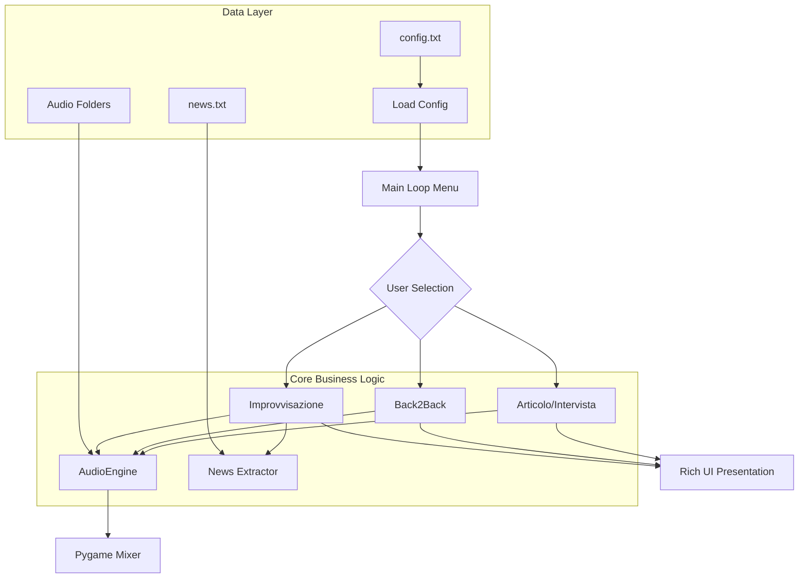

# 🎙️ Speaker Challenge Controller


## 🚀 Dominare il Palcoscenico Digitale

**Speaker Challenge Controller** è un sistema enterprise progettato per l'allenamento e la gestione di prove di parlato in tempo reale. Che tu sia un aspirante speaker radiofonico, un moderatore o un professionista della comunicazione, questo tool offre un ambiente strutturato per testare le tue abilità di improvvisazione, intervista e gestione dei tempi sotto pressione.

L'architettura del software si basa su un motore audio robusto (`pygame.mixer`) e un'interfaccia utente ad alto impatto visivo (`Rich`), garantendo un'esperienza fluida e professionale. Il controller gestisce autonomamente la riproduzione dei sottofondi (tappeti sonori), le transizioni di volume (fade-in/fade-out) e l'estrazione casuale di "notizie lampo" per stimolare la capacità di reazione immediata del parlatore.

---

## 📌 Indice
* [✨ Caratteristiche Principali](#-caratteristiche-principali)
* [🏗️ Architettura del Sistema](#-architettura-del-sistema)
* [📂 Struttura della Repository](#-struttura-della-repository)
* [⚙️ Installazione e Prerequisiti](#-installazione-e-prerequisiti)
* [🛠️ Guida all'Uso](#-guida-alluso)
* [🖼️ Media e Interfaccia](#-media-e-interfaccia)
* [🗺️ Roadmap](#-roadmap)
* [❓ FAQ](#-faq)
* [🤝 Contribuire](#-contribuire)

---

## ✨ Caratteristiche Principali
* **🎮 4 Modalità Operative**: 
    * **Articolo**: Esposizione di un testo su base musicale con timer dinamico.
    * **Back2Back**: Sfida di transizione fluida tra due brani diversi.
    * **Improvvisazione**: Gestione di notizie lampo impreviste durante il parlato.
    * **Intervista**: Simulazione di tempi e ritmi tipici del talk-show.
* **🔊 Audio Engine Enterprise**: Gestione automatizzata di fade-in/out e trigger sonori (Gong) per segnare l'inizio e la fine delle prove.
* **📝 Configurazione Dinamica**: Caricamento parametri via `config.txt` per personalizzare timer, volumi e percorsi delle cartelle.
* **📰 News Management**: Sistema di estrazione e rimozione automatica delle notizie dal dataset per evitare ripetizioni durante le sessioni.

---

## 🏗️ Architettura del Sistema



---

## 📂 Struttura della Repository
```text
.
├── main.py              # Orchestrazione centrale e menu CLI
├── custom_logger.py     # Modulo standard per il logging strutturato
├── config.txt           # File di configurazione parametri (Timer, Volumi, Path)
├── news.txt             # Dataset delle notizie per la modalità improvvisazione
├── audio/               # Cartelle contenenti i tappeti musicali (WAV/MP3)
│   ├── intervista/
│   ├── improvvisazione/
│   └── ...
└── README.md            # Documentazione ufficiale
```

---

## ⚙️ Installazione e Prerequisiti

1. **Requisiti di Sistema**: Assicurati di avere una scheda audio attiva e Python 3.8 o superiore installato.
2. **Clona la repository**:
   ```bash
   git clone https://github.com/mattemn97/speaker-challenge-controller.git
   cd speaker-challenge-controller
   ```
3. **Installa le dipendenze**:
   ```bash
   pip install pygame rich
   ```

---

## 🛠️ Guida all'Uso

### 1. Configurazione
Modifica il file `config.txt` per puntare alle tue cartelle audio locali:
```ini
INTERVISTA_FOLDER=audio/intervista
MAX_VOL_AUDIO=0.8
GONG_PATH=audio/effetti/gong.mp3
```

### 2. Avvio
Esegui il controller dal terminale:
```bash
python main.py
```

### 3. Svolgimento
Seleziona una modalità (es. **2** per Back2Back). Il sistema sceglierà casualmente i brani e gestirà i countdown. 
> [!NOTE]
> Quando vedi il messaggio **[NOTIZIA LAMPO]**, devi integrare immediatamente l'informazione nel tuo discorso senza interrompere il flusso!

---

## 🖼️ Media e Interfaccia

| Schermata | Descrizione |
| :--- | :--- |
| **Menu Principale** |  |
| **Tabella Riepilogo** |  |

---

## 🗺️ Roadmap
- [ ] **Modalità Multiplayer**: Supporto per sfide simultanee tra due speaker.
- [ ] **Registrazione Automatica**: Salvataggio della prova in formato MP3 per riascolto.
- [ ] **Integrazione API**: Estrazione automatica delle news da feed RSS reali.
- [ ] **Web Dashboard**: Interfaccia di controllo remoto via browser.

---

## ❓ FAQ

**Q: Il programma si chiude subito dopo l'avvio, perché?**
**A:** Verifica che i percorsi definiti in `config.txt` siano corretti e che esistano file `.mp3` o `.wav` all'interno delle cartelle.

**Q: Posso usare file FLAC?**
**A:** Attualmente il supporto è limitato a MP3 e WAV per compatibilità nativa con `pygame.mixer`.

---

## 🤝 Contribuire
Sei un developer appassionato di broadcasting? Aiutaci a migliorare!
1. Fai il **Fork** del progetto.
2. Crea un branch per la tua feature (`git checkout -b feature/NuovaModalita`).
3. Invia una **Pull Request** ben documentata.

---

## 📄 Licenza
Rilasciato sotto licenza MIT.

---

## 📨 Contatti
**Project Lead**: mattemn97  
**GitHub**: [https://github.com/mattemn97](https://github.com/mattemn97)

`python` `broadcasting` `speaker` `radio` `cli` `pygame` `rich` `automation` `speech-training` `real-time` `audio-management` `open-source` `developer-tools`
